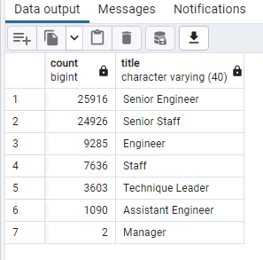

# Pewlett-Hackard-Analysis
Challenge 7 - SQL 

## Overview of the analysis

The Pewlett-Hackard is preparing for the large number of employees retiring. The organization needs to see the number of many employees retiring and their current roles.  

Pewlett-Hackard is considering to introduce mentorship program. Under the mentorship program, experienced and successful employees will be working part time role instead of retiring. They will mentor the newly hired employees. This analysis will help understand whether or not the Mentorship Program is viable solution to mitigate the "silver tsunami".

## Results
Below are the key observations on employees eligible to retire and eligible for mentorship program. 

1. 300,024 Total Employees
2. 72,458 Elgible for retirement
3. Of 72,458 employees eligible to retire, Senior Engineers, Senior Staff and Engineers make up around 80% of retiring roles.  
    * 25,916 retirement eligible employees are Senior Engineers.
    * 24,926 retirement eligible employees are Senior Staffs.
    * 9,285 retirement eligible employees are Engineers.
4. 1,549 employees born in 1965 are eligible for mentorship program. 

##  Summary

There are currently 300,024 active employees. Out of that approximately 24% (72,458 employees) will be retiring soon.

There are only 1,549 employees are eligible for mentorship program (born in 1965) to mentor roles backfill the roles of 72,458 retiring employees.That means it may be too few mentors and may not be effective. Likewise, there are not any eligible mentors for Manager role.  

If the mentorship program eligibity criteria is updated and is offered to employees born on 1964 or 1965, then there will be manageble number of mentees per employess for most roles as shown on chart below. Hence it is recommended to expand the mentorship eligibity criteria to employees born between 1964 and 1965. 

 In addition it is recommended to implement current managers (regardless of their birth year) to mentor newly hired managers. 
